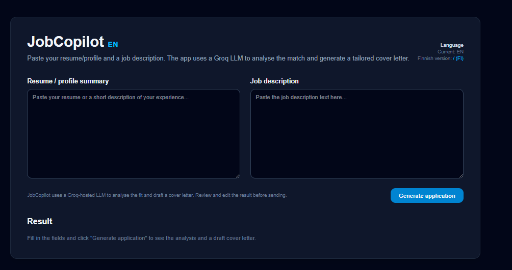

# JobCopilot

JobCopilot is a bilingual AI-powered web application that helps job seekers generate tailored cover letters and understand how well their skills match a given job posting.  
The system analyses a candidate’s resume, evaluates alignment with job requirements, computes a match score (0–100), and drafts a personalized cover letter.

The project demonstrates:
- practical LLM integration using Groq LLaMA models  
- full-stack development with Next.js & TypeScript  
- modern, clean UI design with Tailwind CSS  
- bilingual support (Finnish & English)

---

## Languages

- `/` → Finnish version  
- `/en` → English version  

Both versions have their own API routes and language-aware prompts.

---

## Core Features

- Resume + job description comparison  
- Match score calculation  
- LLM-generated suitability analysis  
- Bilingual cover letter drafting  
- Responsive, polished UI  
- Clean, typed backend logic  

---

# Examples (real inputs & outputs)

Below are real example cases used to demonstrate how JobCopilot responds to different candidate–job combinations.

---

## 🇬🇧 Example 1 — Good Match (English)

---

## 🇬🇧 Example 2 — Poor Match (English)

---

## 🇫🇮 Esimerkki 3 — Hyvä match (suomi)

---

## 🇫🇮 Esimerkki 4 — Huono match (suomi)

---

## Summary

JobCopilot showcases the ability to design and build:

- a real, user-facing AI product  
- structured prompting and JSON-controlled LLM responses  
- a modern Next.js full-stack application  
- multilingual UX  
- clean frontend and backend architecture  

It is intended as a practical, portfolio-ready demonstration of skills relevant to junior software development roles.