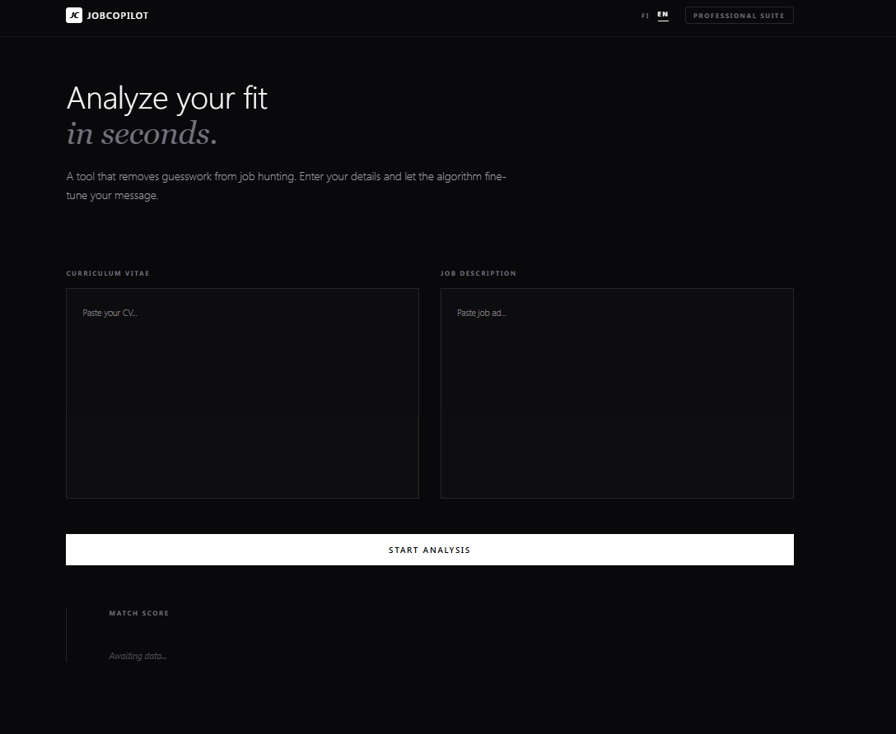
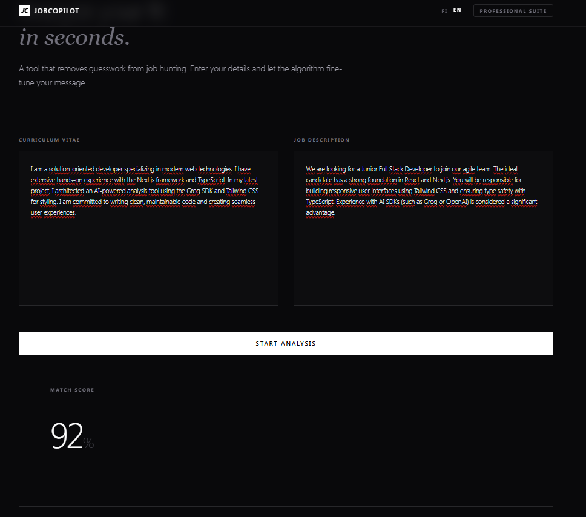
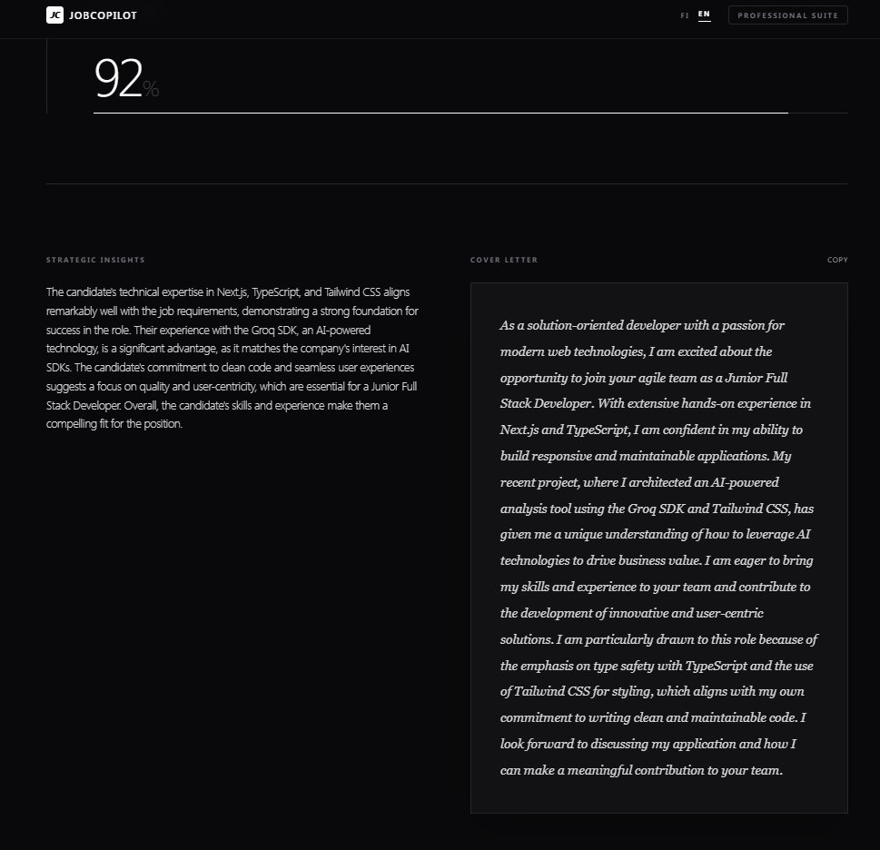
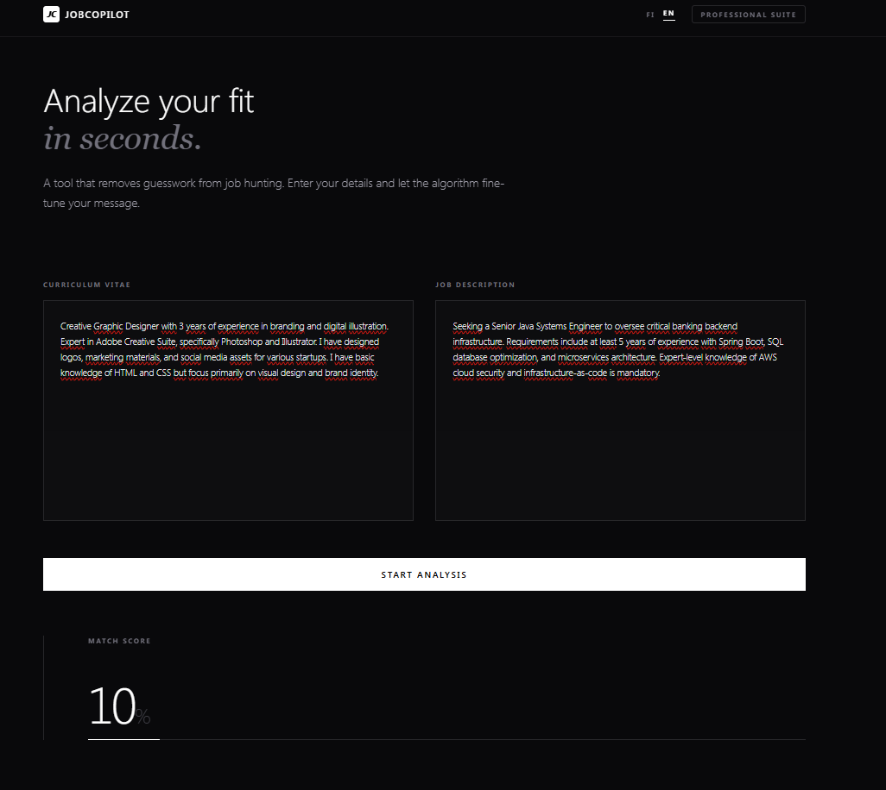
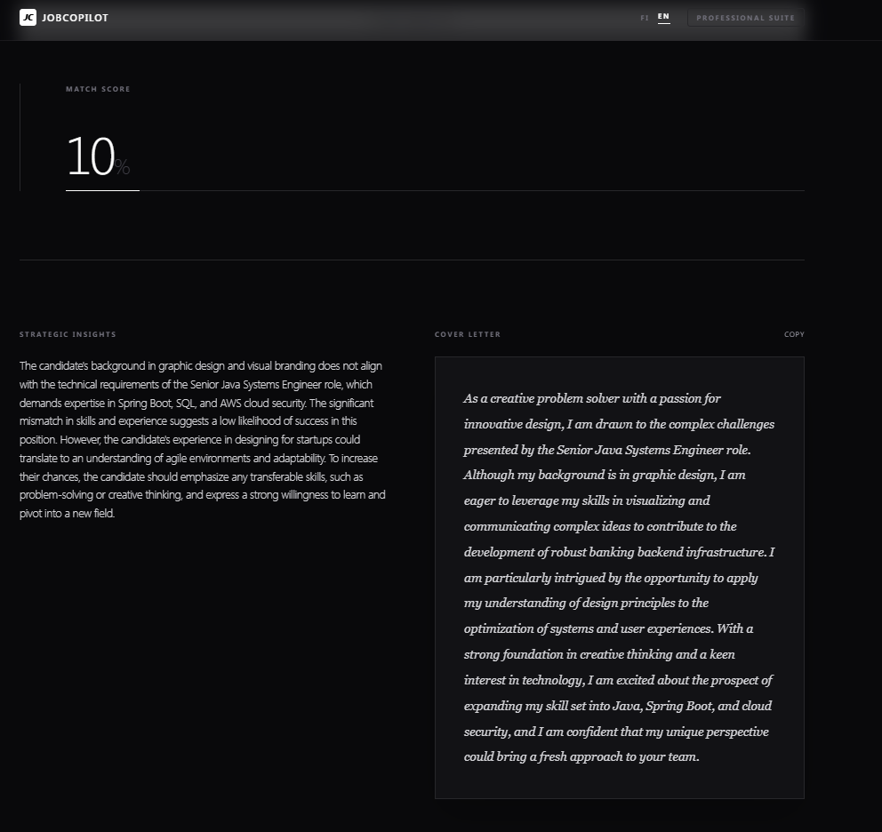

# JOBCOPILOT — PROFESSIONAL AI APPLICATION ARCHITECT

JobCopilot is a high-end, bilingual AI-powered platform designed to provide surgical-grade analysis of candidate resumes against job descriptions. The application delivers strategic insights and tailored cover letters by leveraging advanced Large Language Models.

![Main Interface]

## OVERVIEW
JobCopilot eliminates the ambiguity of job applications through structured data analysis. Built for the modern professional, it focuses on a minimalist, high-conversion user experience and sophisticated prompt engineering to produce professional-grade outcomes.

### CORE CAPABILITIES
* **STRATEGIC MATCH ANALYSIS:** Utilizes Llama-3.3 (Groq) to identify the alignment between candidate expertise and business requirements.
* **REAL-TIME SUITABILITY ENGINE:** Features a dynamic scoring system (0–100%) with visual progress tracking.
* **ELITE DRAFTING:** Generates cover letters focused on value propositions and outcomes rather than generic templates.
* **SOPHISTICATED UI/UX:** A dark-themed, industry-standard interface built with Tailwind CSS v4, utilizing monochrome aesthetics and refined typography.

---

## TECHNICAL STACK

* **FRAMEWORK:** Next.js 15+ (App Router)
* **LANGUAGE:** TypeScript
* **AI ENGINE:** Groq SDK (LLaMA 3.3 70B Versatile)
* **STYLING:** Tailwind CSS v4 (Custom @theme variables)
* **DEPLOYMENT:** Vercel (Optimized for Edge)

---

## ARCHITECTURE AND IMPLEMENTATION

### STRUCTURED JSON INTEGRATION
The application enforces strict JSON schemas for LLM responses. This ensures reliable data flow between the Groq API and the React frontend, allowing for precise rendering of analysis and scoring components.

### BILINGUAL ROUTING
The system features a fully localized architecture for Finnish (`/`) and English (`/en`). Each locale utilizes dedicated prompt engineering to ensure the tone and professional terminology remain appropriate for the target language.

### MODERN DESIGN PRINCIPLES
The interface follows a "SaaS-first" philosophy. Key design elements include:
* **TYPOGRAPHY:** A calculated mix of serif and sans-serif fonts for optimal hierarchy.
* **VISUAL POLISH:** Implementation of glassmorphism and smooth motion primitives for a premium feel.
* **RESPONSIVENESS:** Fully optimized for all device categories, from mobile to ultra-wide displays.

## CASE STUDIES
# HIGH MATCH SCENARIO
Strategic alignment analysis and generated cover letter for a high-suitability candidate.

# CRITICAL GAP IDENTIFICATION
Example of the system identifying missing requirements and providing constructive feedback.

## SUMMARY
JobCopilot serves as a demonstration of full-stack AI product development. It showcases the ability to manage complex prompt engineering, structured backend logic, and a refined frontend experience suitable for modern professional environments.

## INSTALLATION AND DEVELOPMENT

1. **CLONE THE REPOSITORY:**
   git clone https://github.com/williamis/JobCopilot
   cd jobcopilot

2. INSTALL DEPENDENCIES:
npm install

3. CONFIGURE ENVIRONMENT:
Create a .env.local file in the root directory and add your API key:
GROQ_API_KEY=your_api_key_here

4. START DEVELOPMENT:
npm run dev